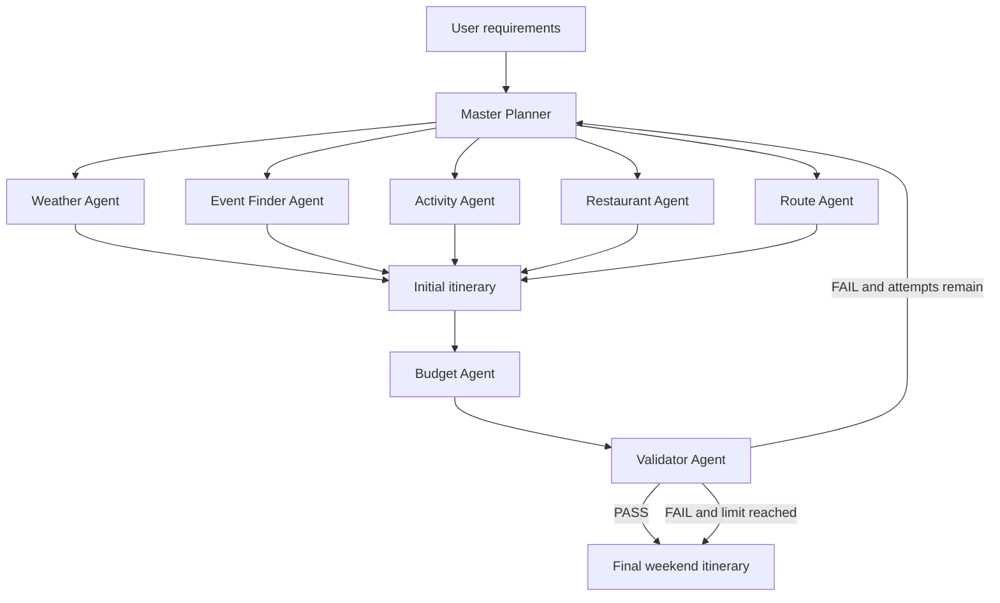

# WeekendWise - Agentic AI Weekend Planner

WeekendWise creates practical 1-3 day local or regional weekend plans for small groups with limited budgets. It combines food, attractions, events, weather, transport, route efficiency, and constraint validation in an iterative LangGraph workflow.

## Problem Statement

Weekend travel planning usually requires comparing many disconnected sources while balancing time, cost, weather, interests, and transport. WeekendWise coordinates these decisions through specialized agents and sends failed plans back for targeted alternatives.

## Objectives

- Create personalized weekend itineraries for 1-3 days.
- Prioritize local/regional travel, food, attractions, events, weather, and efficient routes.
- Track budget by category in INR.
- Show real agent execution results in the UI.
- Validate plans and replan within a bounded number of attempts.
- Provide a deterministic Demo Mode without API keys.

## Architecture



## Agent Descriptions

- **Master Planner**: validates requirements, creates the itinerary, and regenerates it after failed validation.
- **Weather Agent**: provides daily weather and outdoor suitability.
- **Event Finder Agent**: finds date-specific events.
- **Activity Agent**: recommends attractions and activities matching interests.
- **Restaurant Agent**: finds meals and budget-friendly food options.
- **Route Agent**: orders stops and estimates distance, travel time, method, and cost.
- **Budget Agent**: calculates Food, Transport, Activities, Events, Miscellaneous, total, and remaining budget.
- **Validator Agent**: checks budget, weather, duplicates, timing, travel time, and schedule conflicts.

## Agent Communication

Agents communicate through the shared `WeekendState` object. Each node returns only the fields it owns. LangGraph merges those updates. Execution events are appended to `execution_trace`, allowing the Panel dashboard to show actual completed, warning, failed, and replanning steps.

## LangGraph Workflow

`START -> Master Planner -> parallel research agents -> itinerary -> Budget -> Validator`.

A failed validation produces structured issues and recommendations. The graph increments `replan_count`, asks the Master Planner to regenerate the plan, and repeats until validation passes or `MAX_REPLANS` is reached.

## Tools and API Integrations

The current Demo Mode uses deterministic sample data. Live integrations can be added through the optional environment variables in `.env.example`:

- OpenWeatherMap for weather.
- Ticketmaster for events.
- Tavily for web research.
- SerpAPI or another local search provider for restaurants and attractions.
- OpenAI or Azure OpenAI for LLM synthesis.

Only successful API results should be labelled live. Demo records are labelled `source: demo` and the UI identifies Demo Mode.

## Replanning Mechanism

The sample scenario intentionally produces an initial budget warning. The Validator returns an issue such as `Budget exceeds limit by ... INR`. The next Master Planner iteration removes a paid attraction and substitutes a free beach walk. The second Budget Agent evaluation then passes.

## Validation Mechanism

Validator output follows this structure:

```json
{
  "status": "PASS",
  "issues": [],
  "recommendations": []
}
```

The workflow also checks excessive travel time, duplicate activities, budget violations, and future extension points for opening hours and event timing.

## Installation

```powershell
.\.venv\Scripts\Activate.ps1
pip install -r requirements.txt
Copy-Item .env.example .env
```

`.env` is ignored by Git. Never commit API keys.

## Environment Variables

The minimum no-key setup is:

```env
LLM_PROVIDER=mock
DEMO_MODE=true
CURRENCY=INR
MAX_REPLANS=3
```

Optional provider and data API variables are documented in `.env.example`.

### Integrating OpenWeatherMap

1. Create a free account at [OpenWeatherMap](https://openweathermap.org/), open the API keys page, and copy your key.
2. Copy `.env.example` to `.env`.
3. Set these values:

```env
DEMO_MODE=false
OPENWEATHERMAP_API_KEY=your_key_here
```

4. Restart the CLI or Panel server so configuration is reloaded.

The Weather Agent calls the OpenWeatherMap geocoding endpoint to resolve the destination, then the five-day forecast endpoint for the requested dates. The adapter converts the forecast into WeekendWise's daily schema with condition, rain chance, temperature, outdoor score, and `source: openweathermap`. A missing key, unavailable forecast date, or network/API error automatically falls back to clearly labelled Demo Mode data and records a warning in the agent trace.

The same pattern is intended for future live adapters: keep keys in `.env`, add a service wrapper under `trip_planner/adapters/`, return normalized WeekendWise records, and preserve a visible Demo Mode fallback.

## Running Locally

CLI:

```powershell
.\.venv\Scripts\python.exe cli.py
```

Panel dashboard:

```powershell
.\.venv\Scripts\python.exe -m panel serve dashboard.py --show
```

Programmatic API:

```python
from trip_planner import plan_weekend

result = plan_weekend(
    destination="Vizag",
    start_date="2026-09-19",
    end_date="2026-09-20",
    travelers=4,
    budget_inr=10000,
    transport_preference="Local taxi",
    interests=["Food", "Beaches", "Events"],
)
print(result["final_plan"])
```

## Demo Mode

Demo Mode requires no API keys. It is enabled by default in the sample configuration and uses clearly labelled deterministic records. To demonstrate replanning, run the Vizag example with four travelers and a budget of `10000` INR. The first attempt fails budget validation, one replan occurs, and the final plan passes.

## Example Use Case

For four travelers visiting Vizag on Saturday and Sunday with a `₹10,000` total budget and interests in beaches, food, and events, WeekendWise schedules a beach morning, affordable local food, a compact attraction, and an evening event. If the first plan exceeds the budget, the Master Planner requests alternatives and replaces a paid activity with a free option.

## Limitations

- Demo Mode uses sample data rather than current venue availability.
- Live adapters still need to be connected to the weekend schemas.
- Opening-hour and event-conflict checks are currently basic.
- Route estimates are illustrative in Demo Mode.

## Future Improvements

- Add OpenStreetMap/OSRM route computation.
- Add live local venue and restaurant adapters.
- Add stronger opening-hour and event-calendar validation.
- Persist graph traces for audit and comparison.
- Add selectable currencies and accommodation as an optional base location.

## Acknowledgements / Based on

WeekendWise reuses the useful LangGraph, LangChain, Panel, API-wrapper, PDF, and shared-state foundations of the original Voyager repository from which this project was derived. The original repository and its license should be retained and credited according to the upstream GitHub project’s license terms. WeekendWise is a substantial transformation focused on short weekend planning, iterative validation, and bounded replanning.

## Viva Demonstration

1. Start the Panel dashboard in Demo Mode.
2. Enter Vizag, two dates, four travelers, `₹10,000`, Local taxi, and Food/Beaches/Events.
3. Click **Plan My Weekend**.
4. Explain the execution trace: parallel research, initial itinerary, budget warning, validator failure, Master Planner replan, and final validation pass.
5. Show the per-day itinerary, budget categories, route totals, weather explanation, and structured validator result.
6. Change `MAX_REPLANS` or use a very small budget to demonstrate bounded failure handling.
